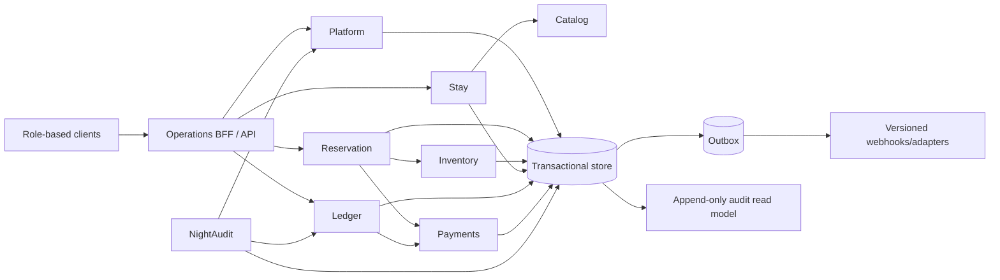

# Bounded Context Map

## Consistency boundaries

- Reservation confirmation locks/checks inventory and commits reservation, price snapshot, audit, and outbox atomically.
- Payment provider calls cannot join the database transaction. An intent is persisted first, the provider is called idempotently, and the result is reconciled.
- Check-in atomically validates room and reservation state, assigns/occupies the room, and appends audit/outbox events.
- Checkout requires a zero folio balance. It transitions the stay and marks the room dirty in one transaction.
- Night audit is a restartable process with named checkpoints and a single property/business-date lease.
